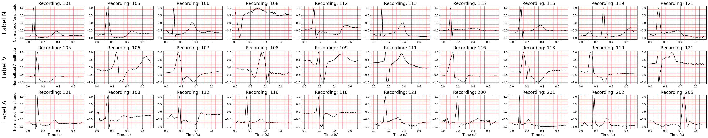
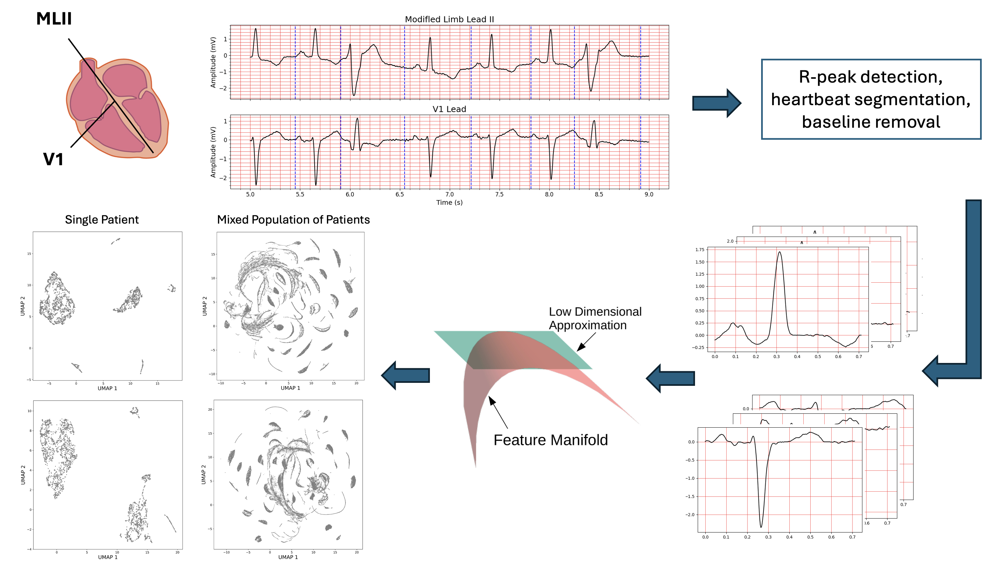
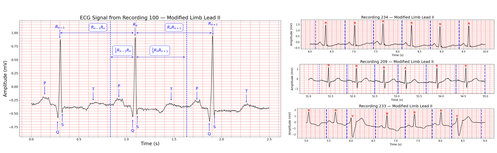
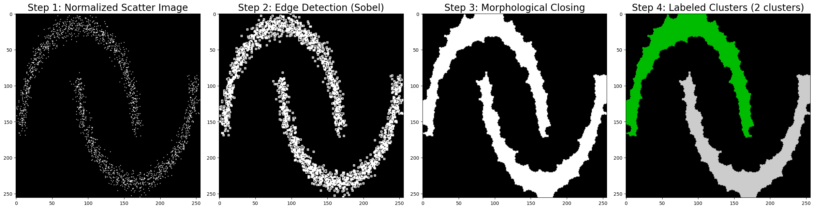
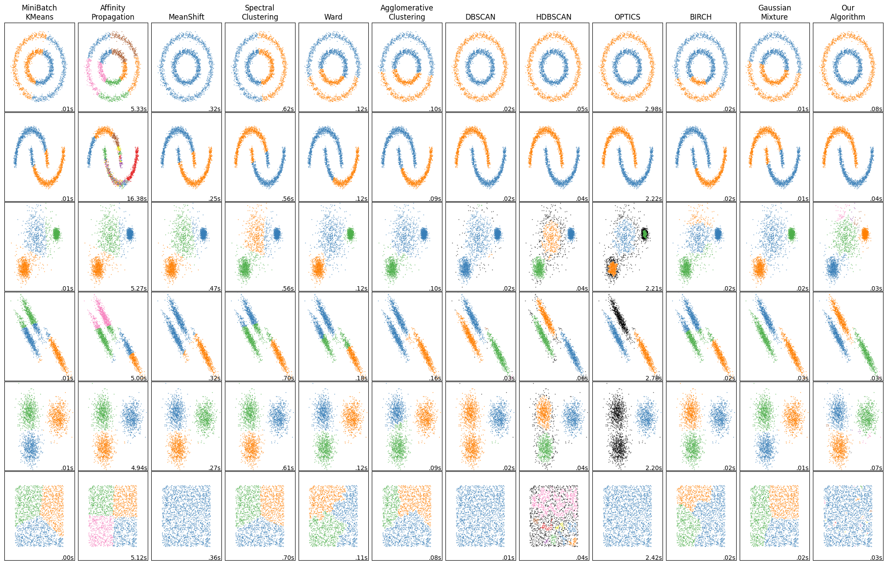
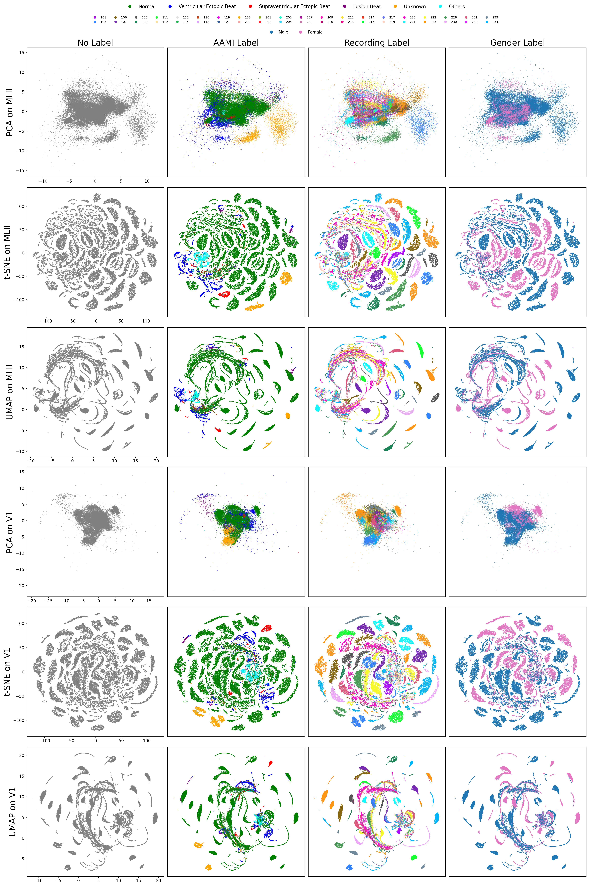

# Manifold Learning for Personalized and Label-free Heart Arrhythmia Detection

---

## 🩺 Problem Statement

Cardiac arrhythmia, a condition that disrupts the heart’s normal rhythm and alters the ECG signal, poses a serious health risk. Detecting arrhythmias requires accurate analysis of heartbeat patterns, yet most existing methods rely on supervised learning, which requires large, labeled datasets. This approach faces three main challenges:

1. **Lead Variability** – A standard 12-lead ECG records twelve distinct waveforms at each time point. Models trained for one lead do not directly generalize to another. Many publicly available datasets, such as MIT-BIH Arrhythmia Database, contain only two leads per recording—Lead II (MLII) and another lead (either V1, V2, V4, or V5)—making it difficult to develop lead-independent models. Even small electrode placement changes during testing can alter signal morphology enough to cause supervised model failure.

2. **Patient Variability** – ECG signals with the same arrhythmia label can differ substantially between individuals. This inter-patient variability reduces robustness to unseen patients.


**Figure 1** – ECG Variability Across People. Each subplot in a given row corresponds to the same arrhythmic label but comes from a different person. Top row: Normal beats (N), middle row: Premature ventricular contractions (V), bottom row: Atrial premature beats (A). All signals are recorded using the lead II of the MIT-BIH dataset.


3. **Dataset Bias** – Training datasets often exhibit bias in both demographic representation and arrhythmia types. In the MIT-BIH dataset, over 80% of beats are normal, and most arrhythmic beats are premature ventricular contractions (PVCs). This imbalance causes many models to overfit common arrhythmias, such as PVCs, while underperforming on rare arrhythmias. Supervised learning is fundamentally limited to the labels provided in the training set and cannot generate labels outside of it. Additionally, different labeling standards for ECG signals limit cross-dataset generalization.


---

## 💡 Our Approach
We address these challenges by combining **unsupervised non-linear dimensionality reduction** with **heartbeat-level analysis**. The approach has three stages:

1. **Segmentation and Preprocessing:** Segment individual heartbeats from raw ECG.  
2. **Dimensionality Reduction:** Project heartbeats into 2D for visualization.  
3. **Clustering:** Group similar heartbeats in 2D space.


**Figure 2** – Schematic of our approach.

### 1. Heartbeat Segmentation & Preprocessing

The first step in real-world analysis is to segment the ECG signals into isolated heartbeats. This requires detecting **R-peaks** from the raw signal. Although many algorithms exist for R-peak detection—such as [Christov](https://biomedical-engineering-online.biomedcentral.com/articles/10.1186/1475-925X-3-28), [Pan–Tompkins](https://ieeexplore.ieee.org/document/4122029), and [NeuroKit2](https://link.springer.com/article/10.3758/s13428-020-01516-y)—a [recent study of ours](https://ieeexplore.ieee.org/document/9745967) found NeuroKit2 to be the most accurate. Since MIT-BIH already provides annotated R-peak locations, we use these directly.

After detecting R-peaks, we segment each heartbeat using a **constant division ratio** between consecutive beats:  
- The first two-thirds of the upcoming RR interval  
- Plus the last one-third of the previous RR interval  

This method (Figure 3) avoids contamination from overlapping beats, even when heart rates vary. All beats are then resampled to 256 points for consistency, and baseline wandering is removed by subtracting a median-filtered version of the waveform (kernel size = 127).

**Figure 3** – ECG Heartbeat Segmentation Method. Three examples from different recordings are shown, including normal beats (label N), premature ventricular contractions (label V), and premature atrial contractions (label A), demonstrating that our segmentation performs well under different arrhythmic conditions.


### 2. Dimensionality Reduction per Patient

The high-dimensional heartbeat signals from each patient are projected into two dimensions using **non-linear dimensionality reduction** techniques, such as [t-distributed Stochastic Neighbor Embedding (t-SNE)](https://www.jmlr.org/papers/v9/vandermaaten08a.html) or [Uniform Manifold Approximation and Projection (UMAP)](https://arxiv.org/abs/1802.03426).
These methods embed high-dimensional data into a low-dimensional space while preserving as much of the original **graph structure** as possible: points that are close in the original space remain close in the embedding, and distant points are placed far apart. Compared to t-SNE, UMAP is faster, better preserves global structure, and scales more efficiently to large datasets. This enables clearer visualization and unsupervised clustering of distinct heartbeat types.


### 3. Clustering

After projecting heartbeat signals into a 2D latent space using **UMAP** or **t-SNE**, clustering is required to separate distinct groups. Manual clustering in the latent space is slow and non-automated. Traditional algorithms, like k-means, require prior knowledge of the number of clusters, limiting flexibility. DBSCAN, a density-based algorithm, does not need the cluster count but requires careful hyperparameter tuning for optimal results.

To address these limitations, we propose an **image-based segmentation approach**. In this method, the 2D scatter plot is treated as an image, where clusters appear as distinct visual regions. By adjusting image resolution, applying edge detection, and performing morphological operations, we segment the image into connected components that correspond directly to clusters. The steps of our algorithm are illustrated in Figure 4, and a comparison with other clustering algorithms on toy datasets is shown in Figure 5.

 
**Figure 4** – Overview of the steps in our clustering algorithm.


**Figure 5** – Example comparison of our clustering algorithm on toy datasets.


---

## 📊 Results


**Figure 6 – Dimensionality reduction and clustering for Recording 207** 

When mixing beats from multiple patients, the embeddings naturally cluster by patient. This highlights how strong inter-patient variability is—even without labels.


**Figure 8 – Dimensionality reduction on mixed population**  

---


## 🚀 How to Run

### 📂 Dataset

The dataset used is the [MIT-BIH Arrhythmia Database](https://www.physionet.org/content/mitdb/1.0.0/).

### Personalized Analysis
To produce results for each person, run:
[Personalized_Arrhythmia_Detection.ipynb](codes/Personalized_Arrhythmia_Detection.ipynb)  

### Population Study
To perform **population-level analysis** (applying dimensionality reduction on all heartbeats from different people), run:
[Population_Analysis.ipynb](Codes/Population_Analysis.ipynb)  

⚠️ Note: Due to the stochastic nature of dimensionality reduction methods like UMAP and t-SNE, results may vary slightly in terms of cluster orientation or positioning.

### ECG Segmentation Playground
To experiment with ECG signal segmentation, run:
[ECG_Segmentation.ipynb](Codes/ECG_Segmentation.ipynb)  

### Clustering
To generate results of our clustering algorithm on toy datasets, run:  
[Clustering Algorithms.ipynb](Codes/Clustering\ Algorithms.ipynb)

---

## 📜 Citation

If you found this repository useful, please consider citing our paper:

```bibtex
@misc{vazifeh2025manifoldlearningpersonalizedlabelfree,
      title={Manifold Learning for Personalized and Label-Free Detection of Cardiac Arrhythmias}, 
      author={Amir Reza Vazifeh and Jason W. Fleischer},
      year={2025},
      eprint={2506.16494},
      archivePrefix={arXiv},
      primaryClass={cs.LG},
      url={https://arxiv.org/abs/2506.16494}, 
}

