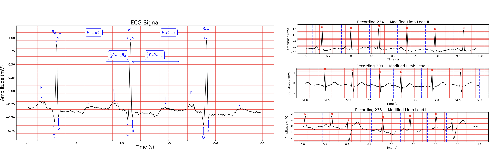
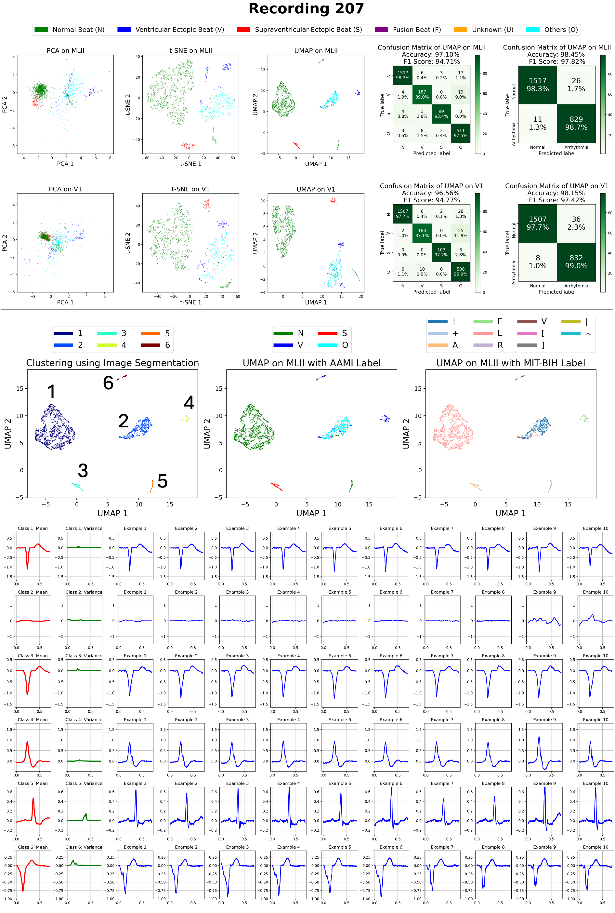
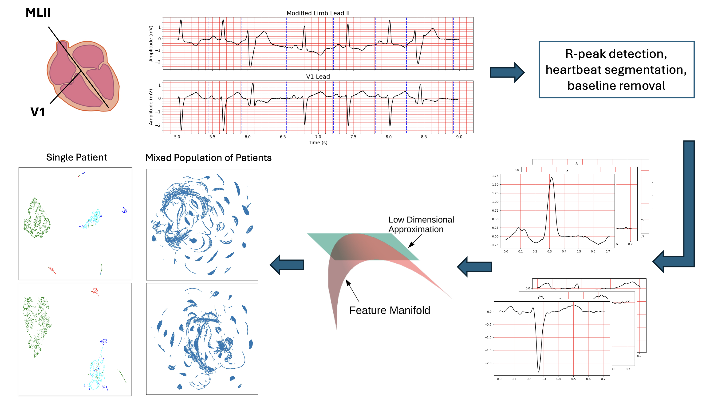

# ECG Visualization and Analysis using Dimensionality Reduction

---

## 🩺 Problem Statement

Automated heartbeat analysis is a crucial step in arrhythmia detection, yet most existing methods rely heavily on **supervised learning**, which depends on large, labeled datasets. This approach faces three main challenges:

1. **Lead Variability** – A standard 12-lead ECG records twelve distinct waveforms for each heartbeat. Models trained for one lead do not directly generalize to another. Many datasets, including the **MIT-BIH Arrhythmia Database**, contain only two leads per recording—Lead II (MLII) and a second lead (either V1, V2, V4, or V5)—making it difficult to develop lead-independent models. Even small electrode placement changes during testing can alter signal morphology enough to cause model failure.

2. **Patient Variability** – ECG signals with the same arrhythmia label can differ substantially between individuals. This inter-patient variability reduces robustness to unseen patients.
3. 
**Figure 1 – ECG heartbeat segmentation method**  


4. **Dataset Bias** – In MIT-BIH, more than **80%** of beats are normal, and most arrhythmic beats are premature ventricular contractions (PVCs). This imbalance leads many models to overfit common patterns while performing poorly on rare arrhythmias. Further, label standards differ between datasets, limiting cross-dataset transferability.

---

## 💡 Our Approach

We address these challenges by combining **unsupervised dimensionality reduction** with **heartbeat-level analysis**.

### 1. Heartbeat Segmentation & Preprocessing

The first step in real-world analysis is to segment the ECG signals into isolated heartbeats. This requires detecting **R-peaks** from the raw signal. Although many algorithms exist—such as Christov, Pan–Tompkins, and [NeuroKit2](https://link.springer.com/article/10.3758/s13428-020-01516-y)—a [recent study of ours](https://ieeexplore.ieee.org/document/9745967) found NeuroKit2 to be the most accurate. Since MIT-BIH already provides annotated R-peak locations, we use these directly.

After detecting R-peaks, we segment each heartbeat using a **constant division ratio** between consecutive beats:  
- The first two-thirds of the upcoming RR interval  
- Plus the last one-third of the previous RR interval  

This method (Figure 1) avoids contamination from overlapping beats, even when heart rates vary. All beats are then **resampled to 256 points** for consistency, and baseline wandering is removed by subtracting a median-filtered version of the waveform (kernel size = 127).

**Figure 1 – ECG heartbeat segmentation method**  


---

### 2. Dimensionality Reduction per Patient

Rather than pooling beats from all patients, we apply **UMAP** or **t-SNE** to each patient individually. This makes it easier to visualize and cluster beat types without supervision, as shown in Figure 2.

**Figure 2 – Dimensionality reduction and clustering for Recording 207**  


---

### 3. Cross-Patient Comparison

When mixing beats from multiple patients, the embeddings naturally cluster by patient. This highlights how strong inter-patient variability is—even without labels.

**Figure 3 – Pipeline for ECG preprocessing and analysis**  


---

## 📂 Dataset

The dataset used is the [MIT-BIH Arrhythmia Database](https://www.physionet.org/content/mitdb/1.0.0/).  
Please download it from the link above.

---

## 🚀 How to Run

### Personalized Analysis
To produce results for each person, run:
[Personalized_Arrhythmia_Detection.ipynb](Personalized_Arrhythmia_Detection.ipynb)  
This notebook will:
- Process the ECG signals and segment heartbeats
- Apply dimensionality reduction
- Generate all the results used in the paper

⚠️ Note: Due to the stochastic nature of dimensionality reduction methods like UMAP and t-SNE, results may vary slightly in terms of cluster orientation or positioning.

---

### Population Study
To perform **population-level analysis** (applying dimensionality reduction on all heartbeats from different people), run:
[Population_Analysis.ipynb](Population_Analysis.ipynb)  


---

### ECG Segmentation Playground
To experiment with ECG signal segmentation, run:
[ECG_Segmentation.ipynb](ECG_Segmentation.ipynb)  

---

### Clustering
To experiment with ECG signal segmentation, run:
[Clustering Algorithms.ipynb](Clustering Algorithms.ipynb)  


---

---

## 📜 Citation

If you found this repository useful, please consider citing our paper:

```bibtex
@misc{vazifeh2025manifoldlearningpersonalizedlabelfree,
      title={Manifold Learning for Personalized and Label-Free Detection of Cardiac Arrhythmias}, 
      author={Amir Reza Vazifeh and Jason W. Fleischer},
      year={2025},
      eprint={2506.16494},
      archivePrefix={arXiv},
      primaryClass={cs.LG},
      url={https://arxiv.org/abs/2506.16494}, 
}

