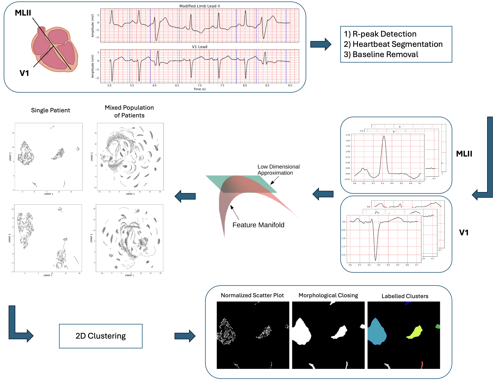
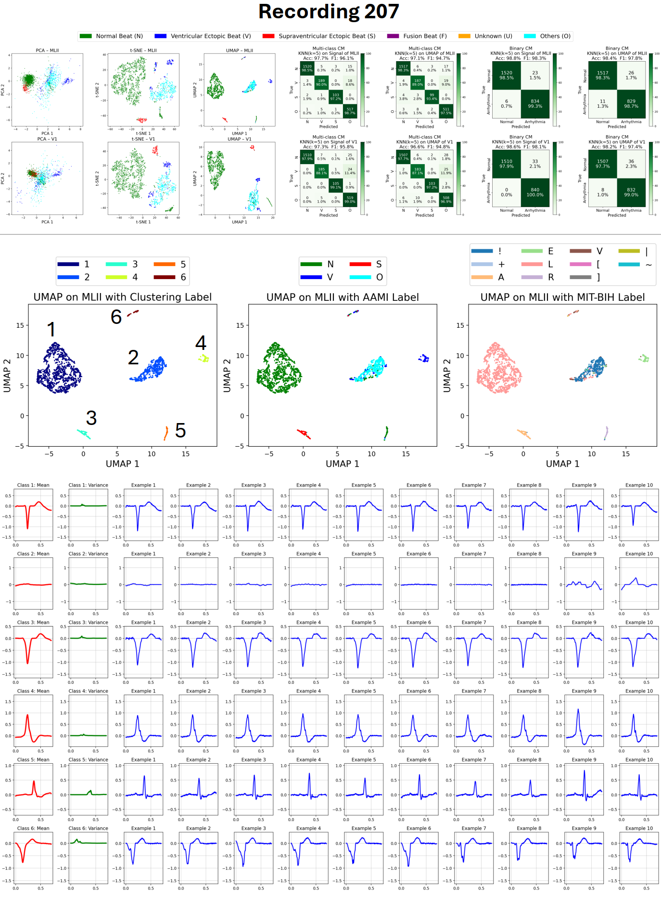
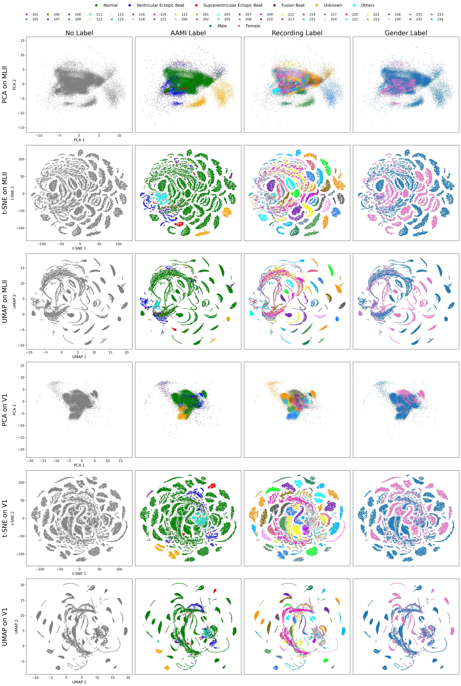
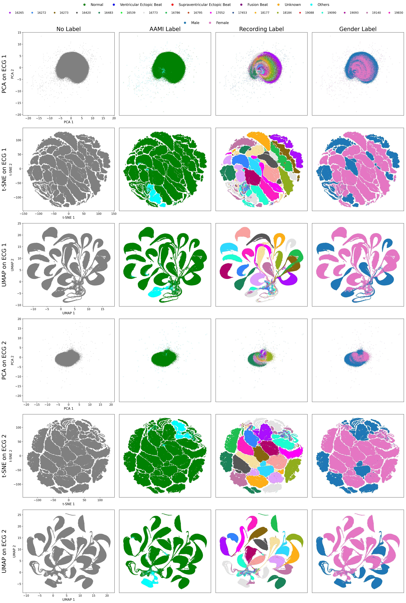

<div align="center">
<h1>Manifold Learning for Personalized and Label-free<br>Heart Arrhythmia Detection</h1>

<a href="https://doi.org/10.1016/j.imu.2026.101770"></a>

<p>
  <a href="https://github.com/amirrezavazifeh">Amir Reza Vazifeh</a><sup>a,b</sup>
  &nbsp;·&nbsp;
  <a href="https://ece.princeton.edu/people/jason-w-fleischer">Jason W. Fleischer</a><sup>a,b,c</sup>
</p>

<sup>a</sup> Department of Electrical and Computer Engineering, Princeton University, Princeton, 08544, New Jersey, USA<br>
<sup>b</sup> Princeton Precision Health, Princeton University, Princeton, 08544, New Jersey, USA<br>
<sup>c</sup> Omenn-Darling Bioengineering Institute, Princeton University, 35 Ivy Lane, Princeton, 08540, New Jersey, USA

<p><em>Informatics in Medicine Unlocked</em>, 2026</p>
</div>

---

</div>

</div>

## Introduction

Cardiac arrhythmia, which disrupts the heart’s normal rhythm and alters ECG signals, poses a serious health risk. Most existing detection methods rely on supervised learning, which requires large labeled datasets but faces three major challenges:

1. **Lead Variability** – A standard 12-lead ECG records twelve distinct waveforms. Models trained for one lead do not directly generalize to another. Even small electrode placement changes during testing can alter signal morphology enough to cause supervised model failure. In addition, many publicly available datasets contain a limited stes of leads, making it difficult to develop lead-independent models. 

2. **Patient Variability** – ECG signals with the same arrhythmia label can differ substantially between individuals. This inter-patient variability reduces robustness to unseen patients.


**Figure 1** – ECG Variability Across People. Each subplot in a given row corresponds to the same arrhythmic label but comes from a different person. Top row: Normal beats (N), middle row: Premature ventricular contractions (V), bottom row: Atrial premature beats (A). All signals are recorded using the lead II of the MIT-BIH dataset.

3. **Dataset Bias** – Training datasets often exhibit bias in both demographic representation and arrhythmia types. In the MIT-BIH dataset, forexample, over 80% of beats are normal, and most arrhythmic beats are premature ventricular contractions (PVCs). This imbalance causes many models to overfit common arrhythmias while underperforming on rare arrhythmias. Supervised learning is also constrained by the labels available in the training data and cannot discover new categories beyond them. Additionally, different labeling standards for ECG signals limit cross-dataset generalization.

---

## Method
We address these challenges by combining **unsupervised non-linear dimensionality reduction** with **heartbeat-level analysis**. The approach has three stages:

1. **Segmentation and Preprocessing:** Segment individual heartbeats from raw ECG.  
2. **Dimensionality Reduction:** Project heartbeats into 2D for visualization.  
3. **Clustering:** Group similar heartbeats in 2D space.


**Figure 2** – Schematic of our approach.

### 1. Heartbeat Segmentation & Preprocessing

The first step in real-world analysis is to segment the ECG signals into isolated heartbeats. This requires detecting **R-peaks** from the raw signal. Although many algorithms exist for R-peak detection such as [Christov](https://biomedical-engineering-online.biomedcentral.com/articles/10.1186/1475-925X-3-28), [Pan–Tompkins](https://ieeexplore.ieee.org/document/4122029), and [NeuroKit2](https://link.springer.com/article/10.3758/s13428-020-01516-y), a [recent study of ours](https://ieeexplore.ieee.org/document/9745967) found NeuroKit2 to be the most accurate. 

After detecting R-peaks, we segment each heartbeat using a **constant division ratio** between consecutive beats:  
- The first two-thirds of the upcoming RR interval  
- Plus the last one-third of the previous RR interval  

This method (Figure 3) avoids contamination from overlapping beats, even when heart rates vary. All beats are then resampled to 256 points for consistency, and baseline wandering is removed by subtracting a median-filtered version of the waveform (kernel size = 127).

**Figure 3** – ECG Heartbeat Segmentation Method. Three examples from different recordings are shown, including normal beats (label N), premature ventricular contractions (label V), and premature atrial contractions (label A), demonstrating that our segmentation performs well under different arrhythmic conditions.

### 2. Dimensionality Reduction:

The high-dimensional heartbeat signals from each patient are projected into two dimensions using **non-linear dimensionality reduction** techniques, such as [t-distributed Stochastic Neighbor Embedding (t-SNE)](https://www.jmlr.org/papers/v9/vandermaaten08a.html) or [Uniform Manifold Approximation and Projection (UMAP)](https://arxiv.org/abs/1802.03426). These methods embed high-dimensional data into a low-dimensional space while preserving as much of the original **graph structure** as possible: points that are close in the original space remain close in the embedding, and distant points are placed far apart. Compared to t-SNE, UMAP is faster, better preserves global structure, and scales more efficiently to large datasets. This enables clearer visualization and unsupervised clustering of distinct heartbeat types.

### 3. Clustering

After projecting heartbeat signals into a 2D latent space using **UMAP** or **t-SNE**, clustering is required to identify distinct groups. Manual clustering in the latent space is slow and non-automated. Traditional algorithms, such as k-means, require prior knowledge of the number of clusters, which limits flexibility. DBSCAN, a density-based method, does not require specifying the cluster count but demands careful hyperparameter tuning for optimal results. To overcome these limitations, we propose an **image-based segmentation approach**. In this method, the 2D scatter plot is treated as an image, where clusters appear as visually distinct regions. By setting image resolution as a hyperparameter, and performing morphological operations, we segment the image into connected components that correspond directly to clusters. A comparison with other clustering algorithms applied to toy datasets is shown in Figures 4.

  
**Figure 4** – Example comparison of our clustering algorithm on toy datasets.

---

## Results

We've shown results of applying our techniques on Recording 207 of the MIT-BIH dataset, as illustrated in Figure 5. Applying UMAP on the modified limb lead II creates 6 separate clusters in 2D. The signals associated with each cluster not only have distinct morphologies but, more importantly, are labeled differently by medical doctors. Results for three more patients are included in our [paper](https://doi.org/10.1016/j.imu.2026.101770).  

We applied the same technique to a dataset containing heartbeats from multiple individuals. Interestingly, as shown in Figure 6 and 7, it produces distinct clusters, each corresponding to a specific person, confirming our observations in Figure 2 and highlighting strong inter-patient variability.

  
**Figure 5** –Analysis of Recording 207 with dimensionality reduction methods. Top: 2D visualizations using PCA, t-SNE, and UMAP. A KNN classifier ($k=5$) is used on the UMAP embeddings to evaluate classification performance.  Bottom: Clustering of 2D UMAP embeddings from the MLII lead, followed by labeling of heartbeat types. Ten example signals per cluster are shown, along with their mean and variance. For all AAMI labels, refer to the topmost legend for character definitions.

  
**Figure 6** – Visualization of heartbeat signal populations from 40 recordings from MIT-BIH. Shown are the 2D latent spaces using PCA, t-SNE, and UMAP from the MLII lead (top set) and the V1 lead (bottom set). Column 1 shows projections without any labels. The subsequent columns show data labeled with (2) heart arrhythmia types according to the AAMI standard, (3) patient recording number, and (4) gender.

  
**Figure 7** – Visualization of heartbeat signal populations from 24 recordings from NSR-DB. Shown are the 2D latent spaces using PCA, t-SNE, and UMAP from the first lead (ECG 1) and the second lead (ECG 2). Column 1 shows projections without any labels. The subsequent columns show data labeled with (2) heart arrhythmia types according to the AAMI standard, (3) patient recording number, and (4) gender.

---

## How to Run

- **Dataset**  
  The dataset used are the [MIT-BIH Arrhythmia Database](https://www.physionet.org/content/mitdb/1.0.0/) and [MIT-BIH Normal Sinus Rhythm Database](https://www.physionet.org/content/nsrdb/1.0.0/).

- **Personalized Analysis**  
  To produce results for each person, run: [Personalized_Arrhythmia_Detection.ipynb](Code/Personalized_Arrhythmia_Detection.ipynb)

- **Population Study**  
  To perform **population-level analysis** (applying dimensionality reduction on all heartbeats from different people), run: [Population_Analysis.ipynb](Code/Population_Analysis.ipynb)

- **ECG Segmentation Playground**  
  To experiment with ECG signal segmentation, run: [ECG_Segmentation.ipynb](Code/ECG_Segmentation.ipynb)

- **Clustering**  
  To generate results of our clustering algorithm on toy datasets, run: [Clustering Algorithms.ipynb](Code/Clustering%20Algorithms.ipynb)
---

## Contact

For questions or issues, please contact [amir.vazifeh@princeton.edu].

---

## Citation

```bibtex
@article{Vazifeh:26,
title = {Manifold Learning for Personalized and Label-Free Detection of Cardiac Arrhythmias},
journal = {Informatics in Medicine Unlocked},
pages = {101770},
year = {2026},
issn = {2352-9148},
doi = {https://doi.org/10.1016/j.imu.2026.101770},
url = {https://www.sciencedirect.com/science/article/pii/S2352914826000407},
author = {Amir Reza Vazifeh and Jason W. Fleischer},
}
